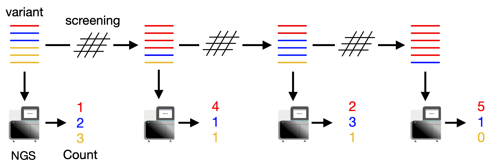
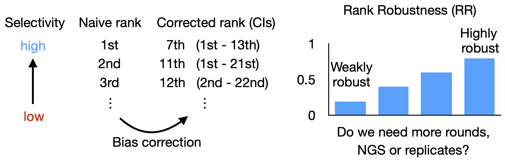

# ACIDES v0

### 1. Deep sequence of forward genetic screening


### 2. From NGS count data, ACIDES estimates the score (selectivity) of each variant with 95%-confidence intervals (CIs)


### 3. ACIDES corrects the naive rank and estimate Ranking Robustness (RR)



## What is ACIDES?

### Why?
Forward genetic screens of mutated variants are a versatile strategy for 
protein engineering and investigation, which has been successfully applied 
to various studies like directed evolution (DE) and deep mutational 
scanning (DMS). While next-generation sequencing can track millions of 
variants during the screening rounds, the vast and noisy nature of the 
sequencing data impedes the estimation of the performance of individual 
variants. 


### How?
ACIDES combines statistical inference and in-silico simulations to improve 
performance estimation in the library selection process by attributing 
accurate statistical scores to individual variants. ACIDES allows experimentalists to reliably estimate variant performance 
on the fly and can aid protein engineering and research pipelines in 
a range of applications, including gene therapy.

### Validations
We tested ACIDES first on a random-peptide-insertion experiment and then on multiple public datasets from DE and DMS studies. 
Please refer to the article for more details.


## Environment

ACIDES is written in Python, tested with Python version 3.8.5, 
numpy 1.21.2, scipy 1.7.3, pandas 1.4.1, matplotlib 3.5.1, 
sklearn 1.1.0, and notebook 6.5.3. (Additionary, 
constrained-linear-regression (0.0.4) has to be 
installed: https://pypi.org/project/constrained-linear-regression/).

In conda, this environment can be created by
````
conda create -n ACIDES_env python=3.8.5 numpy=1.21.2 scipy=1.7.3 pandas=1.4.1 matplotlib=3.5.1 notebook=7.0.4 pip scikit-learn=1.1.0
````
followed by the installation of constrained-linear-regression as
````
"path to anaconda3"/envs/ACIDES_env/bin/pip install constrained-linear-regression
````


## Tutorials

The tutorial of ACIDES in Jupyter Notebook is available from 
[here](./tutorial/ACIDES_tutorial.ipynb). 

## Reference

Takahiro Nemoto, Tommaso Ocari, Arthur Planul, Muge Tekinsoy, Emilia A. Zin, Deniz Dalkara, Ulisse Ferrari, 
*ACIDES: on-line monitoring of forward genetic screens for protein engineering*, 
Nat Commun 2023 (in press).

## Citing ACIDES
````
@article{nemoto2023uncursing,
  title={Uncursing winner’s curse: on-line monitoring of directed evolution convergence},
  author={Nemoto, Takahiro and Ocari, Tommaso and Planul, Arthur and Tekinsoy, Muge and Zin, Emilia A and Dalkara, Deniz and Ferrari, Ulisse},
  journal={bioRxiv},
  pages={2023--01},
  year={2023},
  publisher={Cold Spring Harbor Laboratory}
}
````
